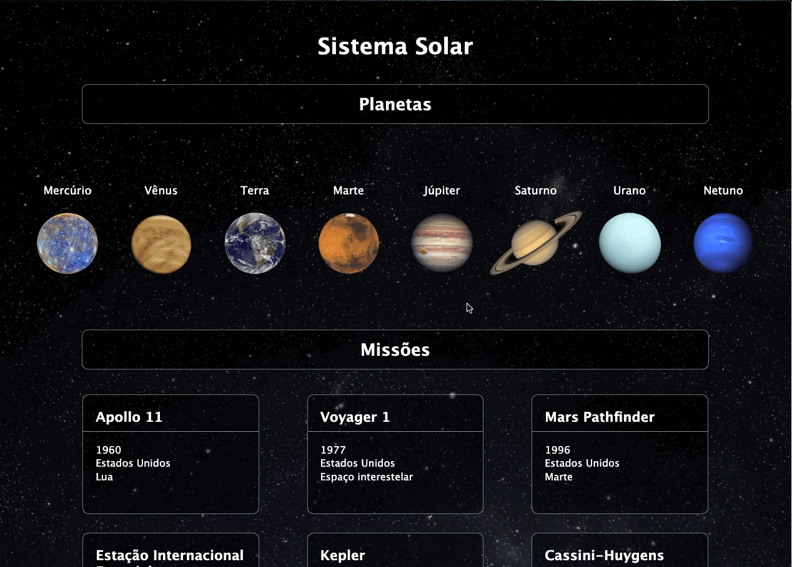

## Table of contents

- [Overview](#overview)
  - [The project](#the-project)
  - [Screenshot](#screenshot)
  - [Links](#links)
- [My process](#my-process)
  - [Built with](#built-with)
- [Author](#author)

## Overview

### The project

Create a web page with solar system informations testing the following habilities:

- Use JSX inside React;
- Create class components in React;
- Correctly use the React class components render() method;
- Create multiple components bt iterating an array;
- Correctly use React props;
- Use React PropTypes to validade prop types;

### Screenshot

### Links

- Solution URL: [Github](https://github.com/RenatoDourad0/Project_Solar_System_Trybe)

## My process

This project was my fist contact with React. It was a realy good practice of the basics.

### Built with

- React
- CSS

## Author
  
  Renato Campos
- [GitHub](https://github.com/RenatoDourad0)
- [Linkedin](www.linkedin.com/in/renato-dourado-b1b301112)
* Contributors besides Renato were responsible for evaluation files that have been removed after approval.
